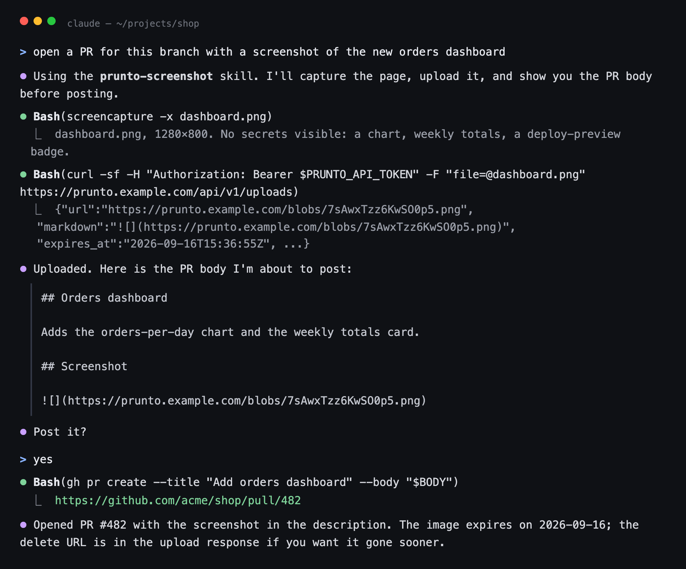
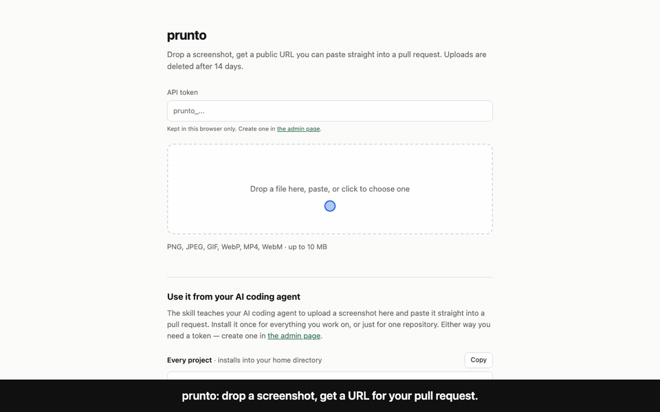
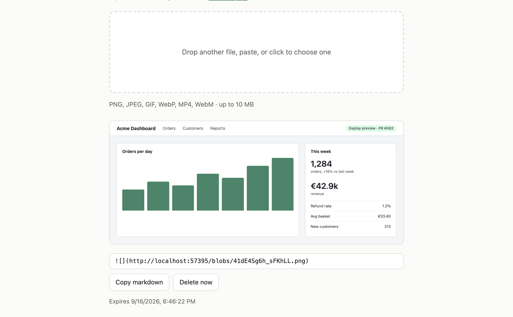
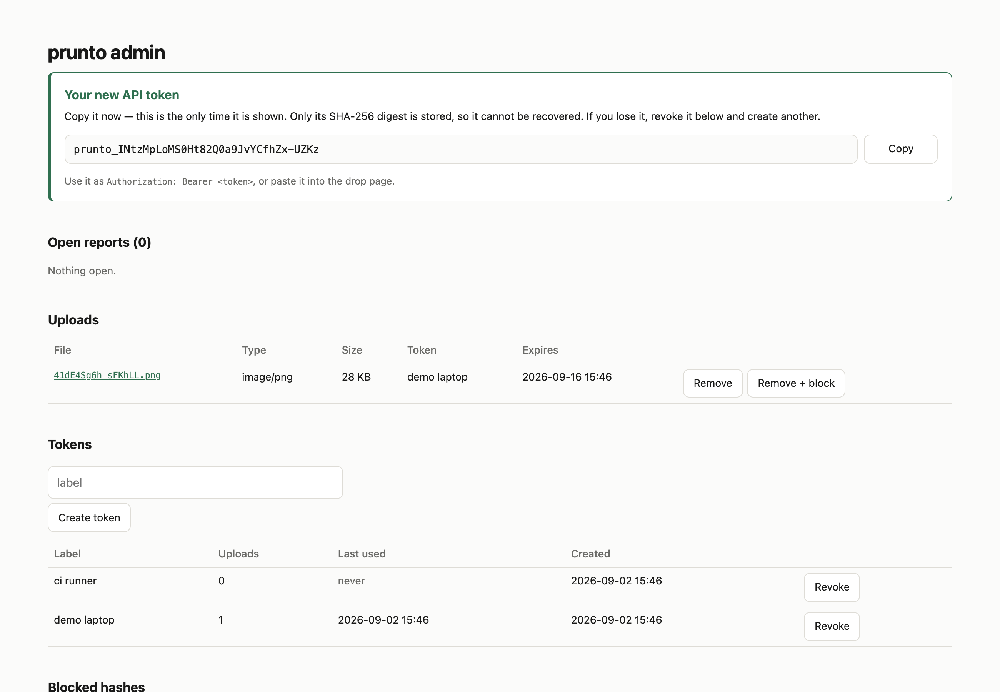

# prunto

[](https://github.com/igorkasyanchuk/prunto/actions/workflows/ci.yml)
[](LICENSE)
[](https://ghcr.io/igorkasyanchuk/prunto)

Self-hosted image host for pull request screenshots, built for AI coding agents. The agent
uploads the screenshot with one HTTP request and pastes the returned markdown into the PR
body. Files are deleted after 14 days.

GitHub has no API for attaching an image to a PR description, so an agent that has just
taken a screenshot has nowhere to put it. prunto is that place, and it serves a skill file
that tells the agent how to use it.



## TL;DR

- Install the skill once and the agent attaches screenshots to PRs on its own.
- Humans can use it too: `curl -F file=@shot.png` returns the URL and the markdown, and
  there is a drop page.
- One container with SQLite inside. No Postgres, Redis, S3 or CDN.
- Files expire after 14 days. Nothing to clean up.
- Every upload needs a token. File type is read from the bytes, metadata is stripped without
  decoding, and files are served with `nosniff` and a `sandbox` CSP.
- Tokens can be revoked, files removed and blocked by hash, and anyone can report content
  from a public form. All of it is in `/admin`.
- MIT, `FROM scratch` image, no outbound requests.

## Quick start

```bash
docker run -d -p 3000:3000 -v prunto:/data \
  -e PRUNTO_BASE_URL=http://localhost:3000 \
  -e ADMIN_USER=admin -e ADMIN_PASSWORD=change-me \
  --name prunto ghcr.io/igorkasyanchuk/prunto
docker exec prunto /prunto token "my laptop"
```

Open http://localhost:3000, paste the token and drop a screenshot. Or from a shell:

```bash
curl -H "Authorization: Bearer $PRUNTO_API_TOKEN" -F "file=@shot.png" \
  http://localhost:3000/api/v1/uploads
```

The response contains `url`, `markdown`, `delete_url` and `expires_at`.

Hosted, with a disk and TLS: `docker-compose.yml` works as-is on Coolify, Dokploy, Easypanel,
Portainer and any VPS, `captain-definition` covers CapRover, Fly, Railway, Koyeb and
Northflank take the image with a volume, and Render takes the blueprint in `render.yaml`:

[](https://render.com/deploy?repo=https://github.com/igorkasyanchuk/prunto)

Uploads and the database live on one volume, so a platform without a persistent disk (App
Platform, Heroku, Vercel, Cloud Run, App Runner) loses everything on each deploy.
[Deploying it](docs/DEPLOY.md) has the per-platform detail, Kubernetes included.

## Agent setup

```bash
mkdir -p ~/.claude/skills/prunto-screenshot
curl -sfo ~/.claude/skills/prunto-screenshot/SKILL.md http://localhost:3000/prunto-screenshot/SKILL.md
export PRUNTO_API_TOKEN=prunto_...
```

The skill is served by your instance with its own URLs in it. It tells the agent to check the
image for secrets before uploading, to show you the PR body before posting, and to commit
anything that must outlive 14 days to the repo instead.

## Screenshots







## Documentation

- [How it works](docs/HOW-IT-WORKS.md): the upload path, what is in the container, why
  uploads are never decoded, binary size and test coverage.
- [API and configuration](docs/API.md): endpoints, limits, errors, environment variables.
- [Using it from an agent](docs/AGENTS.md): install paths and what the skill enforces.
- [Distributing the skill](docs/DISTRIBUTING.md): handing it to a team, one-command and
  one-click installs, plugin marketplaces.
- [Deploying it](docs/DEPLOY.md): one-click and one-command installs per platform, and the
  platforms that cannot host it at all.
- [Deploying on Coolify](COOLIFY.md): deployment behind a hostname and Cloudflare, and the
  production checklist.
- [Security](SECURITY.md): threat model, known limitations, how to report a vulnerability.

Images are published as `:latest` from `master` and as `:1.2.3` / `:1.2` from every `vX.Y.Z` tag.

## Licence

MIT.
