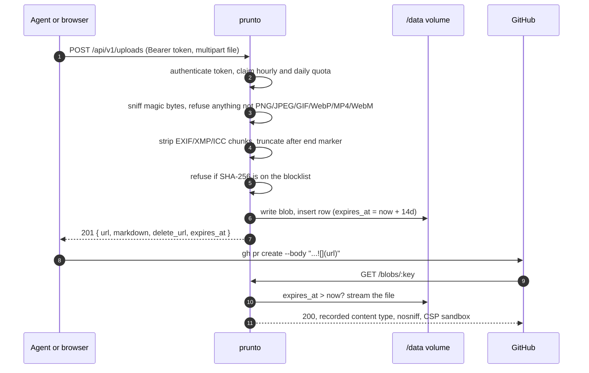
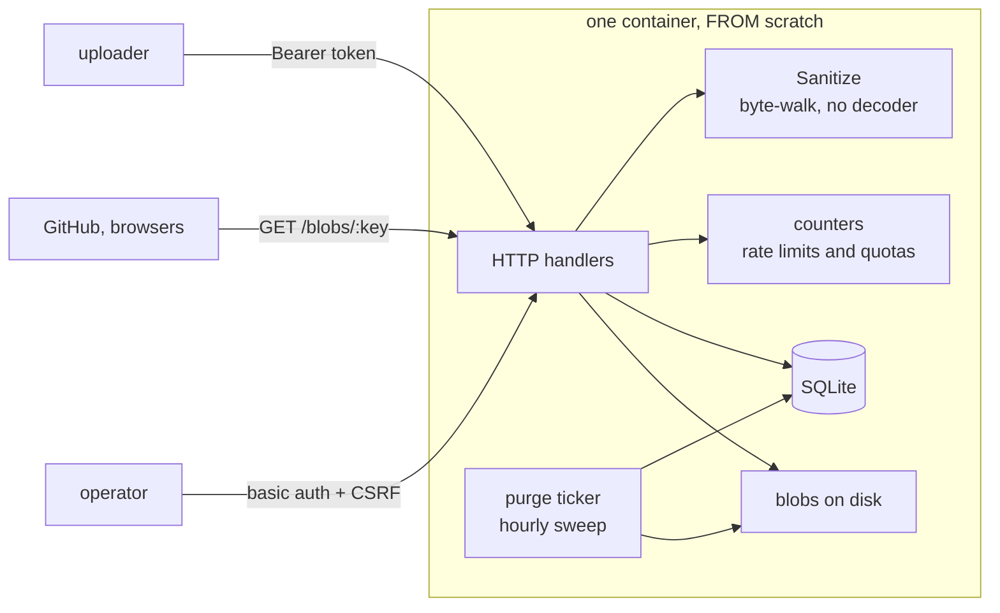

# prunto

[](https://github.com/igorkasyanchuk/prunto/actions/workflows/ci.yml)
[](LICENSE)
[](https://ghcr.io/igorkasyanchuk/prunto)

**Screenshots for pull requests, in one command.** Drop a file, get a public URL, paste
`` into the PR body. Files delete themselves after 14 days.

GitHub has no API for attaching an image to a pull request description. A human drags the
file into the text box; an AI coding agent that just took a screenshot has nowhere to put it.
prunto is that somewhere: a single static binary you run yourself, with an API and a skill
file that teaches Claude Code and friends to use it.


## Why prunto

- **One container, zero services.** No Postgres, no Redis, no S3, no CDN account. SQLite and a
  data volume. Cold start is tens of milliseconds and the process idles at a few MB.
- **Built for agents.** Every instance serves its own `SKILL.md` with its own URLs baked in.
  Install it once and your agent opens PRs with screenshots in them.
- **Paranoid about uploads.** Type from magic bytes only, metadata stripped without ever
  decoding a pixel, every file tied to a revocable token, served as inert content. See
  [SECURITY.md](SECURITY.md) for the full threat model.
- **Nothing to babysit.** Files expire on their own, the audit trail trims itself, the schema
  applies itself at boot. Upgrades are a redeploy.

## Quick start

```bash
docker run -d -p 3000:3000 -v prunto:/data \
  -e PRUNTO_BASE_URL=http://localhost:3000 \
  -e ADMIN_USER=admin -e ADMIN_PASSWORD=change-me \
  --name prunto ghcr.io/igorkasyanchuk/prunto
docker exec prunto /prunto token "my laptop"
```

That is the entire deployment. Open http://localhost:3000, paste the token, drop a screenshot.

```bash
curl -H "Authorization: Bearer $PRUNTO_API_TOKEN" -F "file=@shot.png" \
  http://localhost:3000/api/v1/uploads
```

```json
{
  "url": "http://localhost:3000/blobs/7sAwxTzz6KwSO0p5.png",
  "markdown": "",
  "content_type": "image/png",
  "delete_url": "http://localhost:3000/api/v1/uploads/9f3c...",
  "expires_at": "2026-09-16T15:36:55Z",
  "byte_size": 28311
}
```

[COOLIFY.md](COOLIFY.md) walks through a real deployment behind a hostname and Cloudflare,
with the production checklist to do before an instance is public. Images are published as
`:latest` from `master` and as `:1.2.3` / `:1.2` from every `v*` tag, so you can pin one.

## What it looks like

The drop page. Paste a token once, then drop, paste or pick a file:


The admin page. Tokens, uploads, abuse reports, a hash blocklist and a 90-day audit trail:


## How it works



Everything lives in one process on one volume:



There is no queue to run, no cache to warm, and nothing to restore in the right order. The
cost is that it scales to exactly one container: two replicas would each get their own
database and their own idea of your rate limits.

## For AI coding agents

Every instance serves a rendered skill at `/prunto-screenshot/SKILL.md`. Every URL in it comes
from that instance's configuration, so a self-hosted deployment hands out its own host and
never someone else's.

```bash
mkdir -p ~/.claude/skills/prunto-screenshot
curl -sfo ~/.claude/skills/prunto-screenshot/SKILL.md https://your-host/prunto-screenshot/SKILL.md
export PRUNTO_API_TOKEN=prunto_...
```

From then on "open a PR with a screenshot of the new page" does what it says. The skill tells
the agent to look at the image before uploading it, to show you the PR body before posting,
and that the image breaks after 14 days so anything permanent belongs in the repo. The drop
page also carries a setup prompt you can paste into any assistant.

## Security, briefly

Each line is a test in [`sanitize_test.go`](sanitize_test.go) or [`http_test.go`](http_test.go).
A rule that cannot be expressed as a test is not a rule, it is a hope.

- **Type comes from magic bytes**, never the filename or the declared content type. PNG, JPEG,
  GIF, WebP, MP4, WebM. No SVG (it carries JavaScript), no PDF, no `.mov`, no Matroska wearing
  WebM's signature.
- **Uploads are never decoded.** Decoding attacker bytes to protect against attacker bytes
  moves libpng, libjpeg and libwebp into your process without the browser's sandbox. prunto
  walks the container instead: metadata chunks dropped, trailing bytes truncated, animation
  kept. What that knowingly accepts is a payload inside the compressed pixel stream, which is
  why every blob is served with `nosniff`, the recorded content type and a `sandbox` CSP.
- **Every upload has an owner.** No anonymous uploads. Tokens are 24 random bytes stored as a
  SHA-256 digest, refused if sent in a query string, revocable from `/admin`.
- **Quotas per token:** 10 MB per file enforced as the body is read, 20 uploads per hour,
  200 MB per day, 50 megapixels per image read from the header.
- **Expiry is enforced on the read path**, not just by the hourly sweep.
- **`/admin` is closed until configured.** Basic auth with a constant-time compare, a per-form
  CSRF token, ten wrong passwords per address and it locks for 15 minutes, `no-store`.
- **Nothing dials out.** The image is `FROM scratch`, non-root, no shell, no CA bundle. The
  whole attack surface is the port it listens on.
- Behind Cloudflare, `CF-Connecting-IP` is the only address trusted. Behind your own reverse
  proxy, only the last `X-Forwarded-For` entry, the one the proxy wrote. Anything a client put
  in front of it is never read, and a request missing the header is refused.

The longer version, including what it does *not* defend against and how to report a
vulnerability, is in [SECURITY.md](SECURITY.md).

## By the numbers

| | |
| --- | --- |
| Services required | none |
| Direct dependencies | **1** (`modernc.org/sqlite`, pure Go, no cgo) |
| Go source | 2,279 lines, plus 1,363 lines of tests |
| Tests | 41, **71%** statement coverage, none touch the network |
| Binary | **12.4 MB**, static, `CGO_ENABLED=0` |
| Image | `FROM scratch`: the binary and your data volume, nothing else |
| Cold start | ~45 ms from exec to first served request |
| Memory | 3–5 MB RSS in the production container |

Binary measured with the Dockerfile's own flags (`-trimpath -ldflags="-s -w"`); coverage from
`go test -cover ./...`. CI runs `go vet`, the suite under `-race` and `govulncheck` on every
push, and Dependabot watches the module, the base image and the actions.

## API

| | |
| --- | --- |
| `POST /api/v1/uploads` | multipart `file`, optional `expires_in` (`30m`, `6h`, `7d`, or seconds; capped at 14 days). 201 with the JSON above. |
| `DELETE /api/v1/uploads/:delete_token` | 204. The token is in `delete_url`. |
| `GET /blobs/:key` | the file, with Range support so `<video>` scrubs. 404 once expired. |
| `GET /prunto-screenshot/SKILL.md` | the agent skill, rendered for this instance. |
| `GET /abuse_reports/new` | public takedown form, no account needed. |
| `GET /up` | health check. |

Errors return a JSON `error` string with 401, 403, 413, 422, 429 or 502. For video the
`markdown` field is a `<video>` tag, because that is what GitHub renders.

## Configuration

| Variable | Purpose |
| --- | --- |
| `PORT` | Listen port, default 3000 |
| `DATA_DIR` | SQLite file and the blobs. Default `./data` |
| `PRUNTO_BASE_URL` | This instance's public origin. Every upload and delete URL is built on it. Validated at boot as a bare origin |
| `ADMIN_USER` / `ADMIN_PASSWORD` | Gate `/admin`. Either unset means closed |
| `TRUST_PROXY` | `cloudflare` behind Cloudflare, `forwarded` behind a reverse proxy you control (Traefik, Caddy, nginx), `none` when exposed directly. Anything else is refused at boot |

## Development

```bash
go test ./...
go run . serve
go run . token "my laptop"
```

Uploads go to `./data/blobs` and the whole flow works offline. The screenshots and the GIF
above were recorded against a local instance with Playwright; every step in the recording is
asserted, so the demo cannot show a flow that does not work.

## Not built yet

Accounts, per-user quotas, a dashboard of your own uploads. `RetentionFrom` and the
`api_token_id` column are the seams those hang off.

## Licence

MIT.
