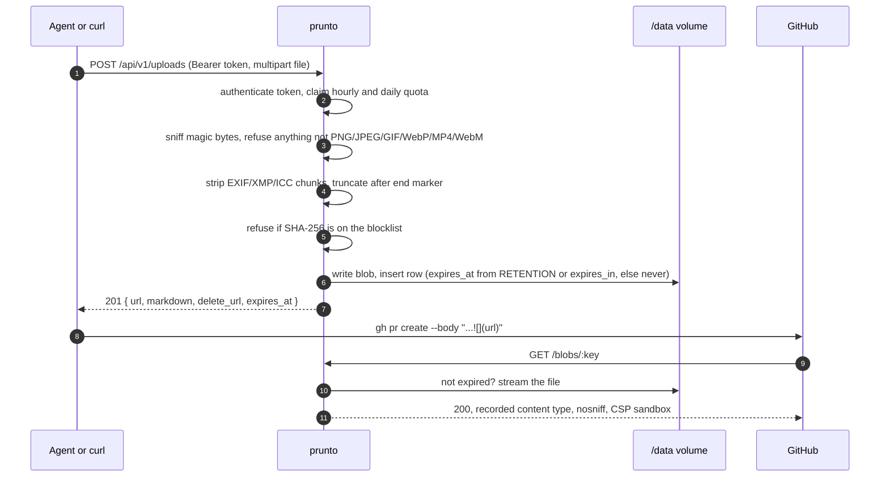
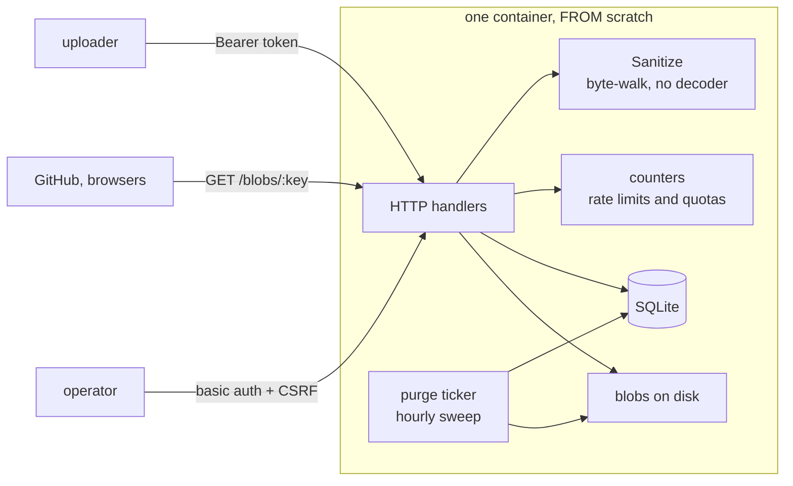

# How prunto works

One process, one file, one volume. SQLite holds the metadata, the blobs sit beside it on disk,
and the same process streams them back from `/blobs/:key`. Rate limits and quotas are counter
rows; the expiry sweep is a `time.Ticker` goroutine.

## The upload path

## What is inside the container

There is no queue to run, no cache to warm, and nothing to restore in the right order. The
cost is that it scales to exactly one container: two replicas would each get their own
database and their own idea of your rate limits. If that day comes, the counters and the
database move to Postgres first.

## Why uploads are never decoded

The obvious way to neutralise a hostile image is to decode and re-encode it so only pixels
survive. That does not remove decoder risk, it relocates it: running libvips means feeding
attacker-controlled bytes to libpng, libjpeg-turbo, giflib and libwebp, the same libraries a
browser uses, inside your own process, next to your database, without the browser's sandbox.
The decompression bomb you then have to defend against exists only because you decode.

So `Sanitize` walks the container instead. Metadata chunks are dropped and everything past the
format's end marker is truncated, so EXIF (and the GPS in it) and any appended payload never
reach the volume, while an animated GIF keeps every frame. What that knowingly accepts is a
payload hidden inside the compressed pixel stream: the recorded content type, `nosniff`,
`Content-Disposition: inline` and a `sandbox` CSP on every blob response are what stop a
browser treating one as active content. If that stops being enough, `Sanitize` in
[`sanitize.go`](../sanitize.go) is the only function that changes.

## Why blobs share the app's origin

There is no second hostname, so those headers are also the only thing between a stored file
and the admin session. Pointing a second hostname at this same container and serving `/blobs`
only from it buys the separation back without adding a bucket.

## Why every upload needs a token

Anonymous upload was deliberately dropped: an anonymous public file host is the highest
abuse-risk shape there is, and a token costs one environment variable. Only the SHA-256
digest is stored, so a lost token cannot be recovered; create another from `/admin`. Every
upload records the token that made it, so abuse always has an owner to cut off.

## By the numbers

| | |
| --- | --- |
| Services required | none |
| Direct dependencies | **1** (`modernc.org/sqlite`, pure Go, no cgo) |
| Go source | 2,466 lines, plus 1,574 lines of tests |
| Tests | 46, **72%** statement coverage, none touch the network |
| Binary | **12.4 MB**, static, `CGO_ENABLED=0` |
| Image | `FROM scratch`: the binary and your data volume, nothing else |
| Cold start | ~45 ms from exec to first served request |
| Memory | 3–5 MB RSS in the production container |

Binary measured with the Dockerfile's own flags (`-trimpath -ldflags="-s -w"`); coverage from
`go test -cover ./...`. CI runs `go vet`, the suite under `-race` and `govulncheck` on every
push, and Dependabot watches the module, the base image and the actions.

## Not built yet

Accounts, per-user quotas, a dashboard of your own uploads. `RetentionFrom` and the
`api_token_id` column are the seams those hang off.
